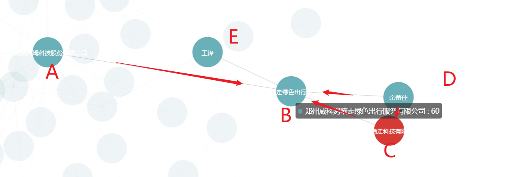

## 需求

**节点**：

- `A`
- `B`
- `C`
- `D`
- `E`

**边**：

- `A -> B`
- `C -> B`
- `D -> B`
- `D -> C`
- `E -> B`


**问题**：

有大量的图数据，根据给定的节点获取关联关系如:求出 A和C的关联关系（`A -> B`，`C -> B`），并用`echarts`进行展示,要求只展示有关联关系的节点。


## 实现思路


1. 使用已有数据，根据关系数据构建邻接表
2. 根据邻接表遍历指定节点在寻找各节点能到达的路径
3. 两两对比能到达的路径集合找出具有相同路径的节点并将结果存储，这时路径中的节点就是我们需要的数据
4. 获取所有路径中唯一的节点ID，删除关系数据和节点数据
5. 移除重复的数据
6. 处理需要展示的节点，设置节点的展示属性


## 准备


### 了解图结构

> **图**（Graph）是一种数据结构，用来表示对象之间的关系。图由**节点**（也叫**顶点**）和**边**组成：
>
> - **节点（顶点，Vertices）**：图中的元素，通常表示某些实体或数据，比如城市、网页、用户等。
> - **边（Edges）**：连接两个节点的线，表示两个节点之间的关系或连接。

#### 图的基本类型


**无向图（Undirected Graph）**：

- 边没有方向，表示节点之间的关系是双向的。例如，朋友关系就是无向的，如果 A 是 B 的朋友，那么 B 也是 A 的朋友。
- 边通常用一条没有箭头的线来表示。

**有向图（Directed Graph）**：

- 边有方向，表示节点之间的关系是单向的。例如，推特上的“关注”关系就是单向的，A 关注 B，但 B 不一定关注 A。
- 边通常用一条有箭头的线来表示，箭头指向关系的方向。

**带权图（Weighted Graph）**：

- 边不仅有方向，还带有权重（Weight），表示节点之间关系的“强度”或“代价”。例如，地图上的城市和城市之间的距离。
- 权重可以是距离、时间、成本等。

**无环图（Acyclic Graph）**：

- 图中不存在从一个节点出发，沿着边可以回到该节点的路径。
- **树**（Tree）就是一种特殊的无环图，其中的每两个节点之间有且只有一条路径。

**连通图（Connected Graph）**：

- 如果图中的每一对节点都是连通的（即有一条路径可以从一个节点到达另一个节点），那么这个图就是连通图。
- 对于有向图，如果从每个节点可以沿着边走到其他所有节点，那么图就是强连通的。

#### 图的表示方法

以下无向图的邻接矩阵：

```
    A -- B
     \  /
      C
```

**邻接表**：用一个列表数组表示图的每个节点。每个节点对应的列表存储与该节点相连的所有其他节点。

```
A -> B, C
B -> A, C
C -> A, B
```

**邻接矩阵**：用一个二维数组表示图

```
    A  B  C
A  [0, 1, 1]
B  [1, 0, 1]
C  [1, 1, 0]
```


#### 图的常见操作


**添加节点**：在图中添加新的节点。

**添加边**：在两个节点之间添加边，建立关系。

**遍历**：遍历图中的所有节点。有两种常见的遍历方法：

- **深度优先搜索（DFS）**：从一个节点开始，沿着一条路径一直走到不能再走为止，然后回溯并继续探索其他路径。
- **广度优先搜索（BFS）**：从一个节点开始，先访问所有邻居节点，然后再从这些邻居的邻居节点继续。

### 使用`echarts`展示图谱数据

#### 实现流程

1. 引入 `ECharts` 库 
2. 准备一个用于放置图表的 DOM
3. 基于准备好的 DOM，初始化 ECharts 实例
4. 使用刚指定的配置项和数据显示图表

#### 实现代码

```html
<!DOCTYPE html>
<html lang="en">

<head>
    <meta charset="UTF-8">
    <meta name="viewport" content="width=device-width, initial-scale=1.0">
    <!-- 引入 ECharts 库 -->
    <script src="https://cdn.jsdelivr.net/npm/echarts/dist/echarts.min.js"></script>
    <title>知识图谱概览</title>
</head>

<body>
    <div class="panel">
        <!-- 准备一个用于放置图表的 DOM -->
        <div id="model-kg-graph" style="height: 800px"></div>
    </div>


</body>
<script>

    var graph_data = {
        categories: ["本供应商", "关联供应商"],
        links: [{ "source": "2006193215", "target": "18692064", "value": "法定代表人,董事长" }, { "source": "394708321", "target": "433370866", "value": "参股100.0000%" }, { "source": "394708321", "target": "7199625", "value": "参股100.0000%" }, { "source": "2006193215", "target": "7199625", "value": "董事长,总经理,法定代表人" }, { "source": "433370866", "target": "18692064", "value": "参股14.9200%" }, { "source": "7199625", "target": "18692064", "value": "参股30.2600%" }, { "source": "1916809741", "target": "18692064", "value": "监事" }, { "source": "1916809741", "target": "7199625", "value": "监事" }],
        nodes: [{ "id": 18692064, "name": "上海建工集团股份有限公司", "itemStyle": { "color": "#d62728" }, "value": 60, "symbolSize": 70, "category": 0 }, { "id": 1916809741, "name": "廉永梅", "itemStyle": { "color": "#047c4a" }, "value": 60, "symbolSize": 60, "category": 1 }, { "id": 2006193215, "name": "杭迎伟", "itemStyle": { "color": "#047c4a" }, "value": 60, "symbolSize": 60, "category": 1 }, { "id": 7199625, "name": "上海建工控股集团有限公司", "itemStyle": { "color": "#d62728" }, "value": 60, "symbolSize": 70, "category": 0 }, { "id": 433370866, "name": "上海国盛（集团）有限公司", "itemStyle": { "color": "#047c4a" }, "value": 60, "symbolSize": 60, "category": 1 }, { "id": 394708321, "name": "上海市国有资产监督管理委员会", "itemStyle": { "color": "#047c4a" }, "value": 60, "symbolSize": 60, "category": 1 }]
    };

    // 指定图表的配置项和数据

    let option = {
        tooltip: {
            // 显示提示框
            show: true,
            // 提示框内容格式化
            formatter: "<div style='display:block;word-break: break-all;word-wrap: break-word;white-space:pre-wrap;max-width: 80px'>" + "{b} " + "</div>"
        },
        // 更新动画持续时间
        animationDurationUpdate: 100,
        // 更新动画的缓动效果
        animationEasingUpdate: 'quinticInOut',
        legend: {
            // // 图例位置，靠右
            // right: 0,
            // 图例位置，居中
            left: 'center',
            // 显示图例
            show: true,
            textStyle: {
                // 图例文字颜色
                color: '#666',
            },
            // 图例内容
            data: graph_data.categories
        },
        series: [
            {
                type: 'graph', // 图类型：关系图
                layout: 'force', // 布局方式：力引导布局
                symbolSize: function (size) {
                    return size; // 节点的大小
                },
                draggable: false, //不可拖拽
                edgeSymbol: ['none', 'arrow'], // 边的符号类型，无符号和箭头
                edgeSymbolSize: [4, 10], // 边符号的大小
                edgeLabel: {
                    normal: {
                        // 显示边的标签
                        show: true,
                        textStyle: {
                            fontSize: 12,
                            color: '#f4c37c'
                        },
                        // 标签内容格式化，显示边的值
                        formatter: "{c}"
                    }
                },
                force: {
                    // 节点之间的斥力
                    repulsion: 2500,
                    // 禁用布局动画
                    layoutAnimation: false,
                    // 边的长度范围
                    edgeLength: [20, 100],
                },
                // 聚焦节点时高亮相邻节点
                focusNodeAdjacency: true,
                // 允许平移和缩放
                roam: true,
                categories: [{
                    name: '本供应商',
                    itemStyle: {
                        normal: {
                            // 节点颜色设置
                            color: "#ec6941",
                            borderColor: '#ffa98b',
                            borderWidth: 6
                        }
                    }
                }, {
                    name: '关联供应商',
                    itemStyle: {
                        normal: {
                            // 节点颜色设置
                            color: '#047c4a',
                            borderColor: '#80c9ff',
                            borderWidth: 6
                        }
                    }
                }],
                label: {
                    normal: {
                        // 显示节点标签
                        show: true,
                        textStyle: {
                            fontSize: 12
                        }
                    }
                },
                // 力引导布局设置
                force: {
                    initLayout: "circular", // 初始布局：圆形
                    layoutAnimation: false, // 禁用布局动画
                    repulsion: 4000 // 节点斥力
                },
                tooltip: {
                    // 提示框内容格式化，显示节点名称
                    formatter: function (node) {
                        return node.data.name;
                    },
                },
                lineStyle: {
                    normal: {
                        opacity: 1, // 边透明度
                        width: 1, // 边宽度
                        color: '#d1d2d2', // 边颜色
                        curveness: 0.2 // 设置边的弯曲程度
                    }
                },
                emphasis: {
                    focus: "adjacency", // 高亮相邻的元素
                    itemStyle: {
                        shadowColor: "rgba(0, 0, 0, 0.5)", // 较浓的阴影颜色，增加视觉深度
                        shadowBlur: 20, // 更大的模糊半径，使阴影效果更加显著
                        borderColor: '#ffa726', // 添加高亮时的边框颜色（橙色），使节点更加突出
                        borderWidth: 2 // 边框宽度增加，使高亮更加明显
                    },
                    lineStyle: {
                        width: 4, // 明显加粗边的宽度
                        color: '#ff7043', // 高亮边的颜色变为橙色，突出显示
                    },
                    label: {
                        textBorderWidth: 2 // 较宽的边框，确保文本清晰可见
                    }
                },
                // 节点数据
                data: graph_data.nodes,
                // 边数据（关系数据）
                links: graph_data.links
            }
        ]
    };
    // 基于准备好的 DOM，初始化 ECharts 实例
    var graph_chart = echarts.init(document.getElementById("model-kg-graph"));

    // 新的配置将取代所有旧的配置
    graph_chart.setOption(option, true);


</script>

</html>
```


## 具体实现


#### 根据关系数据构建邻接表

```java
		 // 初始化局部的节点和邻接列表
        Map<String, Map<String, String>> nodes = new HashMap<>();
        Map<String, Set<String>> adjacencyList = new HashMap<>();

        // 处理关系数据并构建邻接列表
        processRelationships(relationshipsArrays, adjacencyList);
        // 处理节点数据并构建节点信息
        processNodes(nodesArrays, nodes);      
```


```java
/**
 * 处理关系数据并更新邻接列表。
 *
 * @param relationshipsArrays 关系数据的JSON数组
 * @param adjacencyList       邻接列表，表示节点之间的关系
 */
private static void processRelationships(JSONArray relationshipsArrays, Map<String, Set<String>> adjacencyList) {
    IntStream.range(0, relationshipsArrays.size())
            .mapToObj(relationshipsArrays::getJSONObject)
            .forEach(relationship -> addEdge(relationship.getString("startNode"), relationship.getString("endNode"), adjacencyList));
}

    /**
     * 将边添加到邻接列表中。
     *
     * @param startNode     起始节点ID
     * @param endNode       终点节点ID
     * @param adjacencyList 邻接列表，表示节点之间的关系
     */
    private static void addEdge(String startNode, String endNode, Map<String, Set<String>> adjacencyList) {
        // 如果起始节点在邻接列表中不存在，则创建一个新的空集合
        adjacencyList.computeIfAbsent(startNode, k -> new HashSet<>()).add(startNode);
        adjacencyList.computeIfAbsent(endNode, k -> new HashSet<>()).add(endNode);
        adjacencyList.computeIfAbsent(endNode, k -> new HashSet<>()).add(startNode);
    }
```


```java
    /**
     * 处理节点数据并更新节点信息。
     *
     * @param nodesArrays 节点数据的JSON数组
     * @param nodes       节点信息的映射
     */
    private static void processNodes(JSONArray nodesArrays, Map<String, Map<String, String>> nodes) {
        IntStream.range(0, nodesArrays.size())
                .mapToObj(nodesArrays::getJSONObject)
                .forEach(node -> addNode(node.getString("id"),
                        Collections.singletonMap("name", node.getJSONObject("properties").getString("name")), nodes));
    }

    /**
     * 将节点信息添加到节点映射中。
     *
     * @param id         节点ID
     * @param properties 节点属性
     * @param nodes      节点信息的映射
     */
    private static void addNode(String id, Map<String, String> properties, Map<String, Map<String, String>> nodes) {
        nodes.put(id, new HashMap<>(properties));
    }
```


#### 获取指定节点能到达的路径

```java
    /**
     * 根据给定的起始节点，在邻接列表中找到所有可能的路径。
     *
     * @param startNode     起始节点的ID
     * @param adjacencyList 邻接列表，表示节点之间的关系
     * @return 包含所有路径的列表，每条路径是一个节点ID的列表
     */
    public static List<List<String>> findAllPaths(String startNode, Map<String, Set<String>> adjacencyList) {
        List<List<String>> allPaths = new ArrayList<>();
        dfs(startNode, new ArrayList<>(), allPaths, new HashSet<>(), adjacencyList);
        return allPaths;
    }
    
      /**
     * 深度优先搜索算法，用于递归查找所有可能的路径。
     *
     * @param currentNode   当前节点ID
     * @param currentPath   当前路径
     * @param allPaths      保存所有路径的列表
     * @param visited       已访问的节点集合，防止循环
     * @param adjacencyList 邻接列表
     */
    private static void dfs(String currentNode, List<String> currentPath, List<List<String>> allPaths, Set<String> visited, Map<String, Set<String>> adjacencyList) {
        currentPath.add(currentNode);
        visited.add(currentNode);

        // 将当前路径的长度大于2的部分分解成长度为2的子路径并添加到allPaths
        if (currentPath.size() >= 2) {
            for (int i = 0; i < currentPath.size() - 1; i++) {
                List<String> pathPair = new ArrayList<>(currentPath.subList(i, i + 2));
                allPaths.add(pathPair);
            }
        }

        // 遍历当前节点的邻居节点，如果未访问则继续递归
        adjacencyList.getOrDefault(currentNode, Collections.emptySet()).stream()
                .filter(neighbor -> !visited.contains(neighbor))
                .forEach(neighbor -> dfs(neighbor, currentPath, allPaths, visited, adjacencyList));

        // 回溯：移除当前路径中的最后一个节点并标记为未访问
        currentPath.remove(currentPath.size() - 1);
        visited.remove(currentNode);
    }
```


#### 找出两组路径中具有相同终点的路径


```java
List<List<List<String>>> allCommonPaths = findAllCommonPaths(targetNodes, adjacencyList);
```


```java
/**
 * 查找目标节点之间的所有公共路径。
 *
 * @param targetNodes   目标节点ID列表
 * @param adjacencyList 邻接列表，表示节点之间的关系
 * @return 所有公共路径的列表，每个路径是一个节点ID列表的列表
 */
private static List<List<List<String>>> findAllCommonPaths(List<String> targetNodes, Map<String, Set<String>> adjacencyList) {

    List<List<List<String>>> allCommonPaths = new ArrayList<>();

    // 外层循环遍历每一个节点
    for (int i = 0; i < targetNodes.size(); i++) {
        List<List<String>> paths1 = findAllPaths(targetNodes.get(i), adjacencyList);
        // 内层循环从下一个节点开始，避免重复和自比较
        for (int j = i + 1; j < targetNodes.size(); j++) {
            // 查找两个节点之间的所有路径并找出公共路径
            List<List<String>> paths2 = findAllPaths(targetNodes.get(j), adjacencyList);
            List<List<String>> commonPaths = findCommonPaths(paths1, paths2);
            // 将公共路径添加到结果列表中
            allCommonPaths.add(commonPaths);
        }
    }

    return allCommonPaths;
}
```

```java
/**
     * 找出两组路径中具有相同终点的路径。
     * <p>
     * 该方法接收两组路径（每组路径为一个节点ID的列表的列表），并返回所有具有相同终点的路径。
     * 具体实现方式如下：
     * 1. 首先，提取每组路径中每个路径的终点（即路径列表中的最后一个节点）。
     * 2. 找出两个路径集合中终点相同的路径（公共终点）。
     * 3. 最后，返回所有终点相同的路径，包含来自两组路径中的路径。
     *
     * @param paths1 第一组路径，路径以节点ID列表的形式表示。
     * @param paths2 第二组路径，路径以节点ID列表的形式表示。
     * @return 具有相同终点的路径列表，其中每个路径为节点ID的列表。
     */
    public static List<List<String>> findCommonPaths(List<List<String>> paths1, List<List<String>> paths2) {
        // 提取paths1中所有路径的终点，并存储到一个Set集合中
        Set<String> commonEndpoints = paths1.stream()
                .map(path -> path.get(path.size() - 1)) // 获取每条路径的最后一个节点，即终点
                .collect(Collectors.toSet());

        // 取paths2中路径的终点，并与paths1的终点集合取交集，保留共同的终点
        commonEndpoints.retainAll(paths2.stream()
                .map(path -> path.get(path.size() - 1)) // 获取paths2中每条路径的终点
                .collect(Collectors.toSet()));

        // 从两个路径集合中筛选出终点属于commonEndpoints的路径，并合并成一个列表返回
        return Stream.concat(paths1.stream(), paths2.stream())
                .filter(path -> commonEndpoints.contains(path.get(path.size() - 1))) // 过滤出终点在共同终点集合中的路径
                .collect(Collectors.toList());
    }
```


#### 获取所有路径中唯一的节点ID

```java
		// 获取所有路径中唯一的节点ID
        List<String> uniqueNodeIds = getUniqueNodeIds(allCommonPaths);
```


#### 删除无关的数据

```java
deleteUnvailableData(uniqueNodeIds, relationshipsArrays, nodesArrays);
```


```java
     
    /**
     * 获取所有路径中唯一的节点ID。
     *
     * @param allCommonPaths 所有路径的列表
     * @return 唯一节点ID的列表
     */
    public static List<String> getUniqueNodeIds(List<List<List<String>>> allCommonPaths) {
        return allCommonPaths.stream()
                .flatMap(Collection::stream)
                .flatMap(Collection::stream)
                .distinct()
                .collect(Collectors.toList());
    }
```


```java

    /**
     * 从数据集中删除与过滤节点无关的数据。
     *
     * @param filterNodes         需要保留的节点ID列表
     * @param relationshipsArrays 关系数据的JSON数组
     * @param nodesArrays         节点数据的JSON数组
     */
    private static void deleteUnvailableData(List<String> filterNodes, JSONArray relationshipsArrays, JSONArray nodesArrays) {
        // 从relationships中删除与要删除节点相关的关联关系
        for (int i = relationshipsArrays.size() - 1; i >= 0; i--) {
            JSONObject relationship = relationshipsArrays.getJSONObject(i);
            String startNode = relationship.getString("startNode");
            String endNode = relationship.getString("endNode");
            if (!filterNodes.contains(startNode) || !filterNodes.contains(endNode)) {
                relationshipsArrays.remove(i);
            }
        }

        // 从nodes中删除要删除的节点
        for (int i = nodesArrays.size() - 1; i >= 0; i--) {
            JSONObject node = nodesArrays.getJSONObject(i);
            String nodeId = node.getString("id");
            if (!filterNodes.contains(nodeId)) {
                nodesArrays.remove(i);
            }
        }
    }

```


#### 移除重复的数据

```
SONArray relationshipsArrays = new JSONArray();
JSONArray nodesArrays = new JSONArray();
```


```
nodeList.addAll(removeDuplicates(nodesArrays, "id"));
relationshipList.addAll(removeDuplicates(relationshipsArrays, "startNode", "endNode", "type"));
```


```java
/**
 * 移除重复的数据
 *
 * @param jsonArray
 * @param keys
 * @return
 */
private static List<JSONObject> removeDuplicates(JSONArray jsonArray, String... keys) {
    Set<String> uniqueSet = new HashSet<>();
    List<JSONObject> resultList = new ArrayList<>();

    for (int i = 0; i < jsonArray.size(); i++) {
        JSONObject obj = jsonArray.getJSONObject(i);
        StringBuilder uniqueKey = new StringBuilder();
        for (String key : keys) {
            uniqueKey.append(obj.getString(key)).append("_");
        }

        if (uniqueSet.add(uniqueKey.toString())) {
            resultList.add(obj);
        }
    }

    return resultList;
}
```

#### 删除单一节点

```
deleteSingleData(nodeList, relationshipList);
```


```java
	/**
     * 删除单个节点的供
     *
     * @param nodeList
     * @param relationshipList
     */
    private static void deleteSingleData(List<JSONObject> nodeList, List<JSONObject> relationshipList) {
        // 使用HashMap统计每个节点的关联关系数量
        Map<String, Integer> nodeRelationshipCount = new HashMap<>();
        for (JSONObject object : relationshipList) {
            String startNode = object.getString("startNode");
            String endNode = object.getString("endNode");
            // 统计startNode的关联关系数量
            nodeRelationshipCount.put(startNode, nodeRelationshipCount.getOrDefault(startNode, 0) + 1);
            // 统计endNode的关联关系数量
            nodeRelationshipCount.put(endNode, nodeRelationshipCount.getOrDefault(endNode, 0) + 1);
        }

        // 找出关联关系小于2的节点
        Set<String> nodesToDelete = new HashSet<>();
        for (Map.Entry<String, Integer> entry : nodeRelationshipCount.entrySet()) {
            if (entry.getValue() < 2) {
                nodesToDelete.add(entry.getKey());
            }
        }

        // 使用Iterator安全地删除不需要的元素
        Iterator<JSONObject> iterator = relationshipList.iterator();
        while (iterator.hasNext()) {
            JSONObject object = iterator.next();
            String startNode = object.getString("startNode");
            String endNode = object.getString("endNode");
            if (nodesToDelete.contains(startNode) || nodesToDelete.contains(endNode)) {
                iterator.remove();
            }
        }
        iterator = nodeList.iterator();
        while (iterator.hasNext()) {
            JSONObject object = iterator.next();
            String id = object.getString("id");
            if (nodesToDelete.contains(id)) {
                iterator.remove();
            }
        }
    }
```


#### 处理需要展示的节点，设置节点的展示属性

```
 handleShowData(gysNames, nodeList, relationshipList);
```


```java
/**
     * 处理展示节点和关系的配置信息，将原始数据转换为适合图形展示的格式。
     *
     * @param gysmcs           供应商名称列表，用于标识哪些节点属于供应商，从而对这些节点进行特殊处理。
     * @param nodeList         节点列表，每个节点表示图形中的一个实体。该列表将被修改以包含图形展示所需的属性。
     * @param relationshipList 关系列表，每个关系表示图形中两个节点之间的连接。该列表将被修改以包含图形展示所需的属性。
     */
    private static void handleShowData(List<String> gysmcs, List<JSONObject> nodeList, List<JSONObject> relationshipList) {
        // 检查节点列表或关系列表是否为空，如果为空则添加一个默认的“无关联关系”节点
        if (CollectionUtils.isEmpty(nodeList) || CollectionUtils.isEmpty(relationshipList)) {
            handleNoneData(nodeList);
            return;
        }
        // 处理节点列表，配置每个节点的图形属性
        if (nodeList != null && nodeList.size() > 0) {
            // nodes
            for (JSONObject node : nodeList) {
                Long id = node.getLongValue("id");
                String labels = node.getJSONArray("labels").getString(0);
                JSONObject properties = node.getJSONObject("properties");
                String name = ConvertUtil.createString(properties.get("name"));
                properties.put("id", id);
                node.clear();
                //对应图形
                node.put("id", id);
                node.put("name", name);
                //字体颜色
                if (Constants_pb.XM_QYGLGX_MAP.get(labels) != null) {
                    HashMap<String, Object> colorMap = new HashMap<>();
                    if (gysmcs.contains(name)) {
                        colorMap.put("color", Constants_pb.XM_QYGLGX_NODE_GYS_RED);
                    } else {
                        colorMap.put("color", Constants_pb.getXM_QYGLGX_MAP(labels));
                    }
                    node.put("itemStyle", colorMap);
                }
                node.put("value", 60);
                if (gysmcs.contains(name.trim())) {
                    node.put("symbolSize", 70);
                    node.put("category", 0); // 本供应商
                } else {
                    node.put("symbolSize", 60);
                    node.put("category", 1); // 关联供应商，可以分出关联供应商和人员。
                }

            }
        }

        if (relationshipList != null && relationshipList.size() > 0) {
            // relationships
            // 合并相同startNode和endNode的展示数据
            Map<String, JSONObject> mergedRelationships = new HashMap<>();

            for (JSONObject node : relationshipList) {
                String id = node.getString("id");
                String startNode = node.getString("startNode");
                String endNode = node.getString("endNode");
                String type = node.getString("type");
                JSONObject properties = node.getJSONObject("properties");

                String cgbl = Optional.ofNullable(properties.getString("percent"))
                        .map(percent -> {
                            BigDecimal percentValue = new BigDecimal(percent);
                            if (percentValue.compareTo(BigDecimal.ZERO) == 0) {
                                return "";
                            }
                            return percentValue.multiply(new BigDecimal(100))
                                    .setScale(4, BigDecimal.ROUND_HALF_UP)
                                    .toString() + "%";
                        })
                        .orElse("");

                String gxmc = properties.getJSONArray("labels").getString(0);
                String value = gxmc + cgbl;

                String key = startNode + "_" + endNode;

                if (mergedRelationships.containsKey(key)) {
                    JSONObject existingNode = mergedRelationships.get(key);
                    String existingValue = existingNode.getString("value");
                    existingNode.put("value", existingValue + "," + value);
                } else {
                    JSONObject newNode = new JSONObject();
                    newNode.put("source", startNode);
                    newNode.put("target", endNode);
                    newNode.put("value", value);
                    mergedRelationships.put(key, newNode);
                }
            }
            relationshipList.clear();
            relationshipList.addAll(mergedRelationships.values());
        }
    }
```

